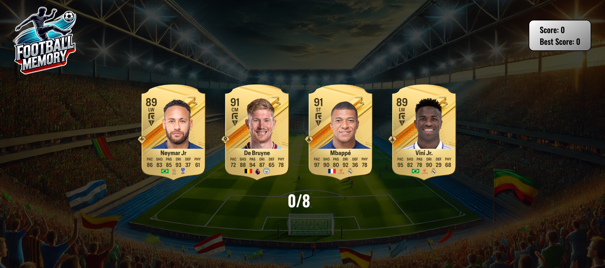

# Memory Game
This app features a football-themed memory game with three different difficulty levels: easy, medium, and hard.

## Description 
The objective of the game is to click on the football player cards without clicking on the same card twice. The game offers three difficulty levels, each with a different winning goal:

- Easy Mode: Win by correctly remembering and clicking 5 unique cards.
- Medium Mode: Win by correctly remembering and clicking 8 unique cards.
- Hard Mode: Win by correctly remembering and clicking 13 unique cards.

### How to Play
1.	Choose a Difficulty Level: Select between easy, medium, and hard modes.
2.	Click the Cards: Click on the football player cards to earn points. Each unique card you click will give you one point.
3.	Avoid Repeating Cards: If you click on a card that you have already clicked before, you will lose the game.
4.	Win the Game: Reach the target number of unique cards for your chosen difficulty level to win the game.

## Links
[Live App](https://fotball-memory.netlify.app/)

